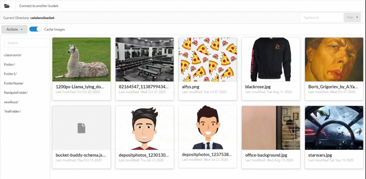

# Bucket Buddy

# Overview

## The problem

Amazon's S3 is great and a very versatile storage service, however it is harder for non-developers to use to manage their objects (such as image files like JPG, PNG, etc.). It can be difficult to navigate an S3 bucket when there are no thumbnails for the images present and no predefined values for tags to be used for objects.

## This solution

Bucket Buddy is a simple React application used to be a tool for users to better manage their S3 bucket objects.

This application can be used to:

- navigate an existing bucket
- upload and delete files
- see the thumbnails of image files
- edit and add tags to an object
- create a schema which will be used to add predefined tags to all objects

## Requirements before installing

### NPM

This project uses React which is a Javascript library. You will need to have some things installed before being able to download and run the project locally.

Ensure to install npm which is a tool used to install all the Javascript modules you will need to run the project. If you are not sure if you have it installed, open your terminal (you can use PowerShell on Windows) and copy paste the following command `npm -v`. If there is an error running the command it means you need to download npm. The simplest way of installing it is downloading it with NodeJS [here](https://nodejs.org/en/)

### Bucket Buddy IAM Role

AWS uses IAM Roles for all their services to handle security and user permissions. Ask you AWS Administrator to give the account crednetials you will use with Bucket Buddy the following permissions

```
{
    "Version": "2012-10-17",
    "Statement": [
        {
            "Sid": "VisualEditor0",
            "Effect": "Allow",
            "Action": [
                "s3:PutObject",
                "s3:GetObject",
                "s3:GetObjectTagging",
                "s3:PutObjectTagging",
                "s3:DeleteObject"
            ],
            "Resource": "arn:aws:s3:::*/*"
        },
        {
            "Sid": "VisualEditor1",
            "Effect": "Allow",
            "Action": "s3:ListBucket",
            "Resource": "arn:aws:s3:::*"
        },
        {
            "Sid": "VisualEditor2",
            "Effect": "Allow",
            "Action": "s3:HeadBucket",
            "Resource": "*"
        }
    ]
}
```

## Installation and running locally

1. Download a ZIP of the project by clicking [here](https://github.com/js-montreal/bucketbuddy/archive/master.zip)
2. Unzip the file wherever you wish (ex: on your Desktop)
3. Open a terminal in the folder you unzipped the files in and type the following command to install everything you need in the project:

```
npm install
```

4. After everything has sucessfully installed, you are ready to start the application by cpy pasting and running the following command in your terminal:

```
npm start
```

5. If run successfully you should see the application start in your default browser and be greeted with the following screen asking you to connect t your bucket :)


# How to use the app

## Connect to your bucket

Bucket Buddy follows the ideology that a user can connect to their bucket by entering the bucket's name, the user's access key and secret access key, and the bucket's region. By going to the main page you will be created with the connection screen above where you can enter all the details to connect to your bucket. If you are unsure ask you AWS adminstrator for the needed details.


## Navigating through the bucket

Navigating through the bucket is similar to a file explorer (folders and files are group together). You can always go back by simply selecting the folder you wish to view in the breadcrumb path above the men buttons


## Creating/Editing a schema for your objects' tags

A folder's tag schema is how bucket buddy knows what tags should be always appied to the objects in the folder. You can create one by clicking on the "Tags in folder Schema" button and you will be prompted to create your field names and default values for them.

Don't worry if you have pre-existing objects, a tag is displayed to let you know they are missing the schema tags and you will be able to add them. You can always go back and edit the schema as you wish and if you wish to no longer have the schema simply deleting the `bucket-buddy-schema.json` file.


## Viewing an object and editing an object's tags

Viewing and editing an object is simply with bucket buddy. Simply click on the object you wish to view. You will then be prompted with the object's details and with two buttons. One will be to edit the object's tags and the other is to delete the file.

To edit the object's tags simply click on the "Edit Tags" button and you will be prompted with a screen similar to when you created your schema. Here you can edit the object's tags and once you are done simply clicko n the "Submit" button to save the changes.


## Uploading objects to your bucket

Uploading objects to your S3 bucket is simple with Bucket Buddy. If you created the schema before attempting to upload an object you will be prompted with the fields and asked to fill them out accordingly. If you did not create a schema you can still upload objects.

To upload an object simply click on the "Upload" button in the top left corner under the "Create Connection" button. There you will be able to upload a file from your computer.



## Adding folders

Like most file systems S3 supports folders too! Creating a folder in bucket buddy is easy. Simple click on "New Folder" in the top left corner of the screen and there you will be able to enter the name of your new folder.

Please be careful because if you write a name of a folder that already exists it will replace the other one!


## Special thanks

This project developed by the team at [Rasion d'Art]("https://www.raisondart.org/") a non-profit organization and is made available for anyone who will find use in making managing their S3 bucket easier.
